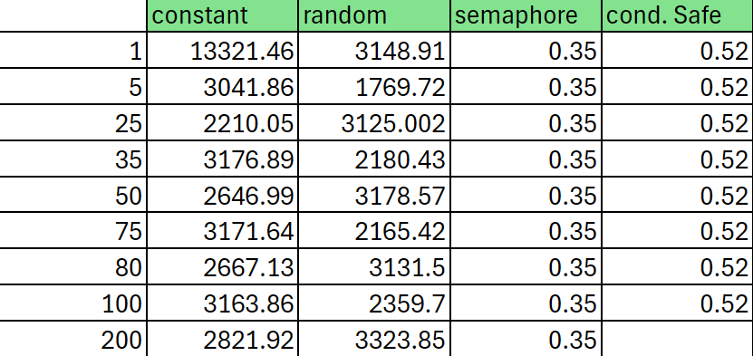
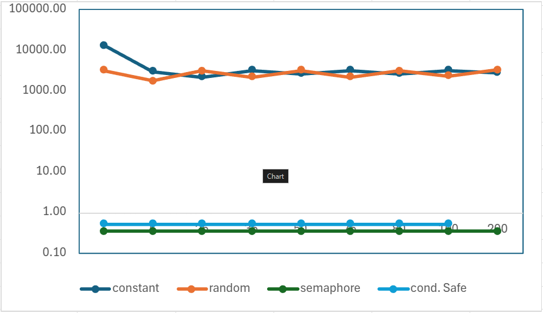

# Ejercicio 14: Delayed Busy Wait

Este ejercicio explora la mejora en la eficiencia de la espera activa mediante la introducción de un retraso, comparando tanto un retraso constante como uno pseudoaleatorio. Adicionalmente, se comparan estas soluciones con el uso de mecanismos de control de concurrencia como semáforos y seguridad condicional.

Tomando un programa como base se realizan las mediciones de duración de cada uno de los mecanismos, las mismas se hicieron usando 8192 hilos en una computadora con sistema operativo Debian GNU/Linux 12 bookworm (x86-64) con una Cinnamon Version 5.6.8. A su vez la computadora cuenta con un procesador Intel® Xeon® CPU E5-2620 v4 @ 2.10GHz x 8, con una memoria RAM de 31.3GB, un disco duro con una capacidad dde 1025.3GB y una targeta de video NVIDIA Geforce GTX 1060 3GB. Con esto en cuenta, los resultados se presentan en la siguiente tabla y gráfica:

[.text-center]

--- 
[.text-center]

## Discusión
La gráfica muestra que los tiempos de ejecución con un delay constante son significativamente mayores que aquellos con un delay pseudoaleatorio en algunos casos. El tiempo máximo de espera se obtuvo con un delay constante de 1 ms, alcanzando un valor de 13321.46 segundos, mientras que con un delay pseudoaleatorio fue de 3323.85 segundos con un delay de 200 ms.

El comportamiento observado sugiere que los retrasos constantes pueden llevar a una mayor acumulación de tiempos de espera, especialmente cuando se utilizan valores pequeños de delay, ya que es el que más se parece a una espera activa pura. En contraste, los retrasos pseudoaleatorios distribuyen de manera más eficiente el tiempo de espera, evitando el exceso de acumulación en la mayoría de los casos. 

En cuanto a la elección para implementar en un proyecto, claramente los semáforos o la seguridad condicional serían las mejores opciones, ya que minimizan los tiempos de espera y proporcionan un control mucho más eficiente de la concurrencia. 

Como se observa, los tiempos de ejecución con semáforos y seguridad condicional son casi constantes, y extremadamente bajos en comparación con los retrasos constantes y pseudoaleatorios, siendo algo mejor  el uso de semáforos en este ejemplo. Esto refuerza la idea de que el uso de mecanismos de control de concurrencia es mucho más eficiente que la espera activa con retraso, tanto constante como pseudoaleatorio y que debido a esto nunca se debe optar por usar la espera activa en un proyecto ya que claramente existen mejores soluciones para el control de concurrencia.

## Estudiantes
 - Aaron Santana Valdelomar C27373
 - Randall Araya Nuñez

