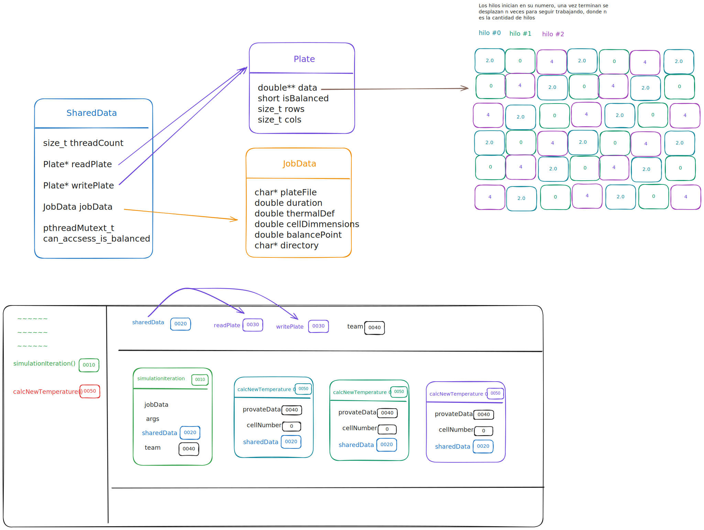

= Transferencia de calor
:experimental:
:nofooter:
:source-highlighter: pygments
:sectnums:
:stem: latexmath
:toc:
:xrefstyle: short

[[problem_statement]]
== Problem statement

== Problem statement

Se necesita una simulación para encontrar el momento de equilibrio térmico de una lámina rectangular con calor constante en sus bordes. La lámina es dividida en 𝑅 filas y 𝐶 columnas de igual alto y ancho ℎ. Cada celda almacena una temperatura que cambia en el tiempo. La simulación sigue la siguiente fórmula para actualizar la temperatura de cada celda:

image::images/formula.png[width=400]

El calor se transfiere desde las celdas más calientes hacia las más frías, considerando las vecinas adyacentes. La transferencia depende del área ℎ², el tiempo Δ𝑡 y la difusividad térmica α del material. La simulación se detiene cuando el cambio de temperatura en todas las celdas internas es menor a un valor ε, indicando que se ha alcanzado el equilibrio térmico.

=== Simulación de calor

La simulación utiliza láminas de distintos materiales, como oro con α=127𝑚𝑚²/s. Cada lámina tiene bordes con temperaturas constantes, y las celdas internas se actualizan a lo largo del tiempo. La simulación continúa hasta que se alcanza el equilibrio, momento en el cual el cambio de temperatura entre estados consecutivos es menor que ε.

=== Programa de simulación

El programa debe ejecutarse desde la línea de comandos con los siguientes argumentos:

- Nombre de un archivo de trabajo (job), obligatorio.
- Cantidad de hilos de ejecución, opcional. Si se omite, se usa la cantidad de CPUs disponibles.

Ejemplo de ejecución:

[source]
----
$ ./heat_simulator job.txt 4
----

El archivo de trabajo contiene varias simulaciones con parámetros como:

- Nombre del archivo de la lámina (binario)
- Duración de cada etapa Δ𝑡
- Difusividad térmica α
- Dimensión de las celdas ℎ
- Sensitividad del equilibrio ε

La simulación continúa hasta alcanzar el equilibrio térmico y genera un reporte con el número de estados 𝑘 y el tiempo transcurrido.

=== Archivo de reporte

El reporte tiene el siguiente formato:

[source]
----
plate001.bin 1200 127 1000 2 2 0000/00/00 00:40:00 plate001.bin 1200 127 1000 1.5 3 0000/00/00 01:00:00
----

El reporte incluye el número de estados 𝑘 y el tiempo en formato `YYYY/MM/DD hh:mm:ss`.

=== Archivo de lámina

El archivo de lámina es binario, con los primeros 8 bytes indicando la cantidad de filas 𝑅, los siguientes 8 bytes indicando las columnas 𝐶, seguidos por 𝑅⋅𝐶 valores flotantes que representan las temperaturas iniciales de cada celda. La simulación usa los valores en little-endian y actualiza la matriz hasta el punto de equilibrio.

=== Diseño concurrente
EL programa deberá recibir la cantidad de hilos de ejecución y dividir el trabajo de tal manera que cada hilo tenga una carga de trabajo similar. Esta solución deberá ser implementada utilizando la librería pthreads.
[[design]]
== Design of solution

[[user_manual]]
== User manual

[[build]]
=== Build

Before compile make sure that you are in Linux environment (Debian is recommended). To compile the project, run the following commands:

[source][bash]
----
$ make clean 
$ make
----

[[usage]]
=== Usage

For usage just execute the following command:

[source][bash]
----
$ bin/pthreads --help
----

That will show how to use the program.

== Testing

For run the tests cases, execute the following commands:

[source][bash]
----
$ make instdeps
----

That will install the dependencies needed for the tests. Such as .7z decompressor.

[source][bash]
----
$ make download
----

That will download the test cases using curl.

[source][bash]
----
$ make run_tests
----

That will run the tests cases.
