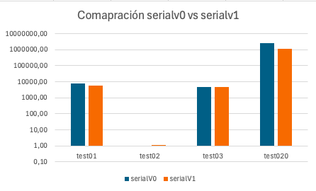
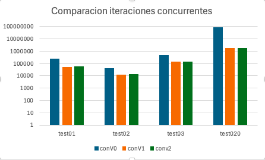
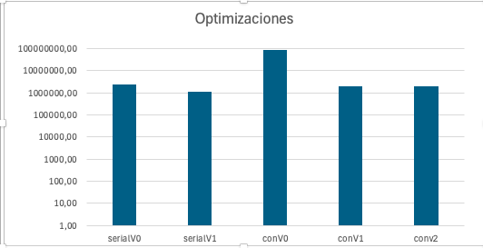
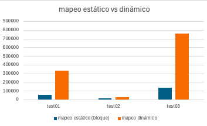

= Reporte de optimizaciones
:experimental:
:nofooter:
:source-highlighter: pygments
:sectnums:
:stem: latexmath
:toc:
:xrefstyle: short

[[serial_optimizations]]
== Optimizaciones seriales

[%autowidth.stretch,options="header"]
|===
|Iter. |Etiqueta |Duración (s) |_Speedup_ |Descripción corta
|0 |Serial0 | 2434,85 |1.00 |Versión serial inicial (Tarea01)
|1 | serialv1 | 1144 | 2,13 | Versión serial final
|===

[[serial_iter00]]
=== Versión serial original (Tarea01)

La versión inicial tenía tres apectos que eran claramente ineficientes:

- En cada iteración se realizaba una copia completa de la matriz de entrada, lo cual se puede evitar con un cambio de punteros.
- Se hacían dos recorridos completos de la matriz en cada iteración, uno para calcular la nuevas temperaturas y otro para verificar si se había alcanzado el estado de balance
- Se recalculaba la parte constante de la fórmula de difusividad térmica en cada celda, lo cual se puede hacer una sola vez.

[[serial_iter01]]
=== Iteración 1

En esta primera iteración se corrigieron los tres aspectos mencionados en la versión original. Primero se cambió la forma de almacenar la matriz de temperaturas, de manera que en cada iteración se intercambian los punteros de la matriz de entrada y la matriz de salida, de esta manera sólo se crean 2 matrices en todo el programa (una de escritura y una de lectura). Segundo, se cambió la forma de recorrer la matriz, de manera que en un solo recorrido se calculan las nuevas temperaturas y se verifica si se ha alcanzado el estado de balance. Tercero, se calcula la parte constante de la fórmula de difusividad térmica una sola vez.

=== Conclusiones
Con estas optimizaciones se logró reducir el tiempo de ejecución de la versión serial original en un 53%. Esto se ve represenado de mejor manera en la siguiente gráfica:

[[serial_iter02]]

[[concurrent_optimizations]]
== Optimizaciones concurrentes

[%autowidth.stretch,options="header"]
|===
|Iter. |Etiqueta |Duración (s) |_Speedup_ |Eficiencia |Descripción corta
|- |Serialv1 | 1144 |1.00 |1.00 |Versión serial final
|1 |Concv0 | 87343,80 | 0,01 | 0,1% |Versión concurrente inicial (Tarea02)
|2 | concv1 | 2058,83 | 1,18 | 18,7% | Reutilización de hilos
|3 | concv2 | 1956,00 | 1,24 | 24% | Cambio de mapeo
|===

[[conc_iter00]]
=== Versión concurrente inicial (Tarea02)

La versión concurrente inicial se basa en la versión serial final, pero se intenta paralelizar el cálculo de las nuevas temperaturas en cada celda de la matriz. Esta primera versión concurrente presenta 2 problemas críticos:

- Se crean y se destruyen demasiados hilos en cada iteración del ciclo de optimización, lo cual es muy costoso.
- Se usa un mapeo cíclico lo que puede ocacionar errores de caché, aumentando el tiempo de ejecución.

[[conc_iter01]]
=== Iteración 1

En la primera iteración se corrigió el problema de creación y destrucción de hilos, de manera que se crean los hilos una sola vez y se reutilizan en cada iteración. Para esto se usó una barrera implemenada con semáforos para que los hilos esperen a que todos terminen de calcular las nuevas temperaturas antes de continuar con una nueva iteración.
[[conc_iter02]]

=== Iteración 2
En esta segunda iteración se corrigió el problema de mapeo cíclico, de manera que se usó un mapeo por bloques, ahora cada hilo se encarga de calcular las nuevas temperaturas de un bloque de celdas de la matriz. De este modo se evitan los problemas de caché y se reduce el tiempo de ejecución.

=== Conclusiones
Con estas optimizaciones se logró reducir el tiempo de ejecución de la versión concurrente inicial en un 98%. Esto se ve represenado de mejor manera en la siguiente gráfica:

[[optimization_conclusion]]

[[optimization_comparison]]
=== Comparación de optimizaciones

En un principio se logró reducir el tiempo de ejecución de la versión serial original en un 53% con respecto a la versión serial inicial. Sin embargo, al intentar paralelizar el cálculo de las nuevas temperaturas en cada celda de la matriz, se obtuvo un tiempo de ejecución mucho mayor que la versión serial final, esto es debido al incorrecto uso de los hilos y al mapeo cíclico. Con las optimizaciones realizadas en la versión concurrente se logró reducir el tiempo de ejecución en un 98% con respecto a la versión concurrente inicial. A continuación se muestra una gráfica comparativa de las optimizaciones realizadas:

Desdichadamente, no se logró superar el tiempo de ejecución de la versión serial final, pero se logró reducir el tiempo de ejecución de la versión concurrente inicial en un 98%.
[%autowidth.stretch,options="header"]

[[concurrency_optimizations]]

[[Mapeo estático y dinámico]]

=== Mapeo estático y dinámico

Se tomaron en cuenta dos tipos de mapeo para la distribución de las tareas entre los hilos:

- Mapeo estático: En este mapeo se divide el trabajo en bloques de tamaño fijo y se asigna un bloque a cada hilo. Este mapeo es útil cuando se conoce de antemano el tamaño de las tareas y se quiere evitar el overhead de asignar tareas en tiempo de ejecución.

- Mapeo dinámico: En este mapeo se divide el trabajo por celadas, se asigna una celda a cada hilo y cuando un hilo termina de procesar dicha celda, se le asigna una nueva.

El siguiente gráfico muestra la comparación de los tiempos de ejecución de las versiones concurrentes con mapeo estático y dinámico:

Claramente se puede observar que el mapeo estático es más eficiente que el mapeo dinámico, 5.4 veces más rápido en promedio. Esto se debe a que el mapeo estático evita el overhead de asignar tareas en tiempo de ejecución, lo cual es muy costoso.

[%autowidth.stretch,options="header"]

(pendiente)

[[concurrency_comparison]]
=== Comparación del grado de concurrencia

(pendiente)

