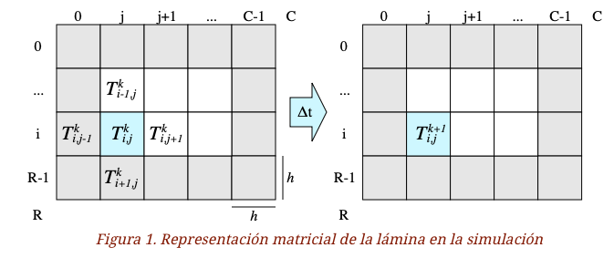
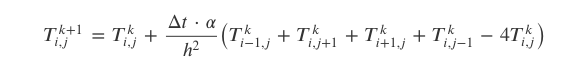
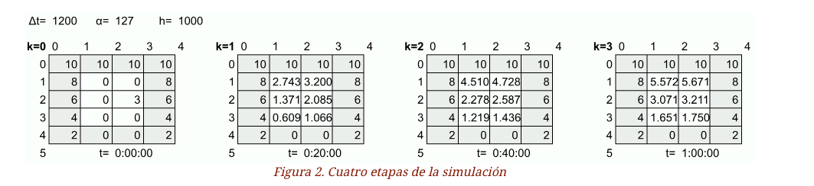

= Transferencia de calor
:experimental:
:nofooter:
:source-highlighter: pygments
:sectnums:
:stem: latexmath
:toc:
:xrefstyle: short

[[problem_statement]]
== Problem statement

Se necesita una sencilla simulación por computadora que ayude a encontrar el momento de equilibro térmico de una lámina rectangular a la que se le inyecta calor constante por su borde. La lámina (en inglés, plate) corresponde a un rectángulo de dos dimensiones de un mismo material. Para efectos de la simulación, el rectángulo es dividido en 𝑅 filas y 𝐶 columnas ambas de igual alto y ancho ℎ como se ve en la Figura 1. Esto genera una matriz cuyas celdas son todas cuadradas, de ancho y alto ℎ.

Cada celda de la matriz almacena una temperatura, la cual puede cambiar en el tiempo. Se usa la notación 𝑇𝑘𝑖,𝑗 para indicar la temperatura de la celda ubicada en la fila 𝑖, columna 𝑗, en el instante o estado 𝑘. Después de transcurrido un tiempo Δ𝑡, la simulación pasará del instante 𝑘 al instante 𝑘+1, y la temperatura en la lámina habrá variado (estado). Como es sabido, la energía se transfiere de un área más caliente hacia una más fría. La nueva temperatura en la celda (𝑖,𝑗) será 𝑇𝑘+1𝑖,𝑗 como se ve en la parte derecha de la Figura 1, y puede estimarse a partir de su temperatura en el instante (o estado) anterior y la temperatura de sus celdas vecinas por la relación:

De acuerdo a la relación anterior, la temperatura de una celda en el instante o estado 𝑘+1 indicado por 𝑇𝑘+1𝑖,𝑗, es el resultado de la temperatura que la celda tenía en el instante o estado anterior 𝑇𝑘𝑖,𝑗 más la pérdida o ganancia de energía que la celda haya sufrido con sus inmediaciones durante ese período Δ𝑡. Para efecto de la simulación, las inmediaciones son las cuatro celdas vecinas en forma de cruz como se ve en la Figura 1. Esta transferencia de energía o calor está regida por:

- La energía que la celda 𝑖,𝑗 recibe de sus inmediaciones, y se calcula como la suma de las temperaturas de las cuatro vecinas 𝑇𝑘𝑖−1,𝑗+𝑇𝑘𝑖,𝑗+1+𝑇𝑘𝑖+1,𝑗+𝑇𝑘𝑖,𝑗−1.

- La energía que la celda pierde y se distribuye a sus cuatro celdas vecinas, calculada como −4𝑇𝑘𝑖,𝑗.

- La transferencia no es instantánea, sino que depende del área que recorre. Entre mayor es el área de la celda, más tiempo requerirá la energía para desplazarse y equilibrarse con sus vecinas. Por eso la ganancia y pérdida de energía calculada en los dos puntos anteriores, se divide entre el área de la celda ℎ2.

- La cantidad de energía transferida es proporcional al tiempo. Es decir, entre más tiempo Δ𝑡 se permita entre el estado 𝑘 y el estado 𝑘+1, más energía podrá intercambiar la celda con sus vecinas. Por esto, el intercambio de energía calculado en los puntos anteriores se multiplica por la duración del estado Δ𝑡.

- La cantidad de energía intercambiada en el periodo de tiempo depende de la calidad conductora de la lámina. Materiales como la madera son lentos para transmitir energía, mientras que los metales son eficientes para este fin. Para reflejar esta realidad, el intercambio de energía calculado en los puntos anteriores se multiplica por la difusividad térmica, que corresponde a una constante α que indica a qué tasa el material logra transmitir energía desde un punto caliente hacia otro frío a través de él. Sus unidades son de área entre tiempo, como 𝑚2𝑠 ó 𝑚𝑚2𝑠. Por ejemplo, la madera tiene una difusividad cercana a 0.08𝑚𝑚2𝑠 mientras que el oro de 127𝑚𝑚2𝑠, es decir, el oro transfiere calor aproximadamente 1500 veces más rápido que la madera.

=== Simulación de calor

La Figura 2 muestra cuatro instantes o estados de una simulación hipotética de una lámina de oro (difusividad térmica α=127𝑚𝑚2𝑠). Para efectos de la simulación, la lámina fue dividida en 5 filas y 4 columnas, cuyas celdas son de ℎ=1000𝑚𝑚 de lado, es decir, de un metro de ancho por un metro de alto.

En el estado o instante cero (𝑘=0) la simulación carga la matriz de un archivo que indica las temperaturas iniciales de cada celda de la lámina. Es importante resaltar que los bordes de la lámina no cambian su temperatura en el tiempo, dado que es el punto donde las personas experimentadoras "inyectan o retiran calor". Por esto los bordes se resaltan con color de fondo en la Figura 2. De esta figura puede verse que en la parte superior se inyecta calor a una temperatura constante de 10 unidades (Celcius, Farenheit, o Kelvin), y conforme se desciende en la lámina, se provee menos calor en los bordes.

En cada instante o estado, la simulación debe actualizar las celdas internas de la lámina de acuerdo al modelo físico presentado en la sección anterior. En el instante o estado 𝑘=1 habrán transcurrido 𝑘Δ𝑡=1200𝑠=20min. Como puede verse en la Figura 2, las temperaturas en los bordes se mantienen constantes, pero las celdas internas han adquirido energía de los bordes, en especial las celdas en la parte superior. Sin embargo, la celda 2,2 perdió energía pese a que está al lado de un borde de temperatura 6, dado que tres de sus vecinas estaban más frías que ella en el estado previo 𝑘=0.

En el estado 𝑘=2 habrán transcurrido 𝑘Δ𝑡=2⋅1200𝑠=40min. Como puede verse en la Figura 2, las celdas internas han incrementado lentamente su temperatura dado a que son de 1𝑚2 cada una. Incluso la celda 2,2 ha visto reflejado un incremento. En el estado 𝑘=3 que en la vida real ocurriría una hora después de que inicia el experimento, la temperatura interna sigue creciendo, pero aún no se ha equilibrado con los valores de los bordes.

Se desea que la simulación continúe hasta que se haya alcanzado el punto de equilibrio, lo cual ocurre cuando el calor se ha estabilizado en la lámina. Para esto se proveerá un parámetro épsilon (ε) a la simulación, que representa el mínimo cambio de temperatura significativo en la lámina. En cada estado 𝑘 se actualizan todas las celdas internas de la lámina. Si al menos una de las celdas internas tiene un cambio en su temperatura mayor a ε, indica que no se ha alcanzado aún el equilibrio y la simulación continúa con el siguiente estado 𝑘+1, de lo contrario se detiene y reporta los resultados de la simulación. Por ejemplo, si la simulación de la Figura 2 se corriera con un ε=2 unidades de temperatura, ésta terminaría en el estado 𝑘=2, dado que el cambio de temperatura más grande del estado 𝑘=1 a 𝑘=2 se da en la celda 1,1, calculada como |4.51−2.74|=1.77, y es menor que el ε=2.

El modelo físico presentado en la sección anterior es muy sensible a los parámetros de entrada, y dependiendo de la combinación de valores puede producir resultados incorrectos. El modelo se acerca más a la realidad entre más celdas se usen para representar la lámina (filas y columnas) y más pequeños sean los cambios de tiempo (Δ𝑡). Sin embargo acercarse a la realidad impone más presión sobre los recursos de la máquina, lo que hace la simulación más lenta, por lo que se desea una versión paralelizada de la simulación, que pueda encontrar el punto de equilibrio térmico en el menor tiempo posible.

=== Programa de simulación

Se necesita que la solución concurrente sea invocada desde la línea de comandos con los siguientes argumentos:

- El nombre de un archivo de trabajo (job). Es obligatorio. Si no se provee, se debe emitir un mensaje de error.

- La cantidad de hilos de ejecución. Es opcional, y si se omite, se debe suponer la cantidad de CPUs disponibles en el sistema.

Por ejemplo, la siguiente invocación indica que se quiere realizar todas las simulaciones indicadas en el archivo de trabajo job001.txt con 16 hilos de ejecución.

[source, TXT]
----
bin/heatsim jobs/job001.txt 16
----

Nota: Cuando un usuario indica el nombre de un archivo, puede agregar la ruta (relativa o absoluta) donde éste se encuentra. A nivel de programación en C/C++ no es necesario hacer un trabajo adicional para poder abrir los archivos, simplemente se usa el texto provisto por el usuario como nombre del archivo a abrir. El sistema operativo se encarga automáticamente de resolver las rutas relativas o absolutas.

=== Archivo de trabajo

El archivo de trabajo (job file) es un archivo de texto que lista varias láminas y los parámetros de simulación que las personas experimentadoras quieren investigar en cada una de ellas. El siguiente es un ejemplo de un archivo de trabajo job001.txt:

[source, TXT]
----
plate001.bin 1200 127 1000 2
plate001.bin 1200 127 1000 1.5
plate002.bin 60 0.08 450 0.75
----

Cada línea del archivo de trabajo contiene una simulación independiente de las demás. Una simulación consta de los siguientes parámetros separados por espacios en blanco:

- Nombre del archivo que contiene la lámina en su estado inicial. El contenido de este archivo se explica más adelante. La ubicación del archivo de simulación es relativo al archivo de trabajo. Por ejemplo si el anterior es el contenido del archivo de trabajo jobs/job001.txt significa que plate001.bin se encuentra también en la subcarpeta jobs/plate001.bin. Una alternativa para trabajar con rutas se ofrece más adelante.

- La duración de cada etapa Δ𝑡 en segundos.

- La difusividad térmica α del material medida en unidades de área entre tiempo, por ejemplo: 𝑚2𝑠 ó 𝑚𝑚2𝑠. Puede suponer que las unidades de tiempo siempre son las mismas que las usadas en el parámetro anterior.

- Las dimensiones ℎ de las celdas medidas en las mismas unidades de área que el parámetro anterior pero lineales (distancia).

- La sensitividad del punto de equilibrio ε, en las mismas unidades de temperatura que se usaron en el archivo de la lámina.

Su programa debe realizar todas las simulaciones indicadas en el archivo de trabajo. Una simulación involucra cargar la lámina como una matriz en memoria, y actualizarla a lo largo de varios estados hasta que se haya alcanzado el punto de equilibrio térmico. Una vez que esto ocurre se debe hacer un reporte a las personas investigadoras, como se indica en la próxima sección.

Nota: Como se indicó anteriormente, los archivos de láminas son relativos al archivo de trabajo. Puede usar procesamiento de cadenas para extraer el prefijo del archivo de trabajo. Alternativamente puede solicitar un tercer argumento en línea de comandos al programa de simulación que indica la ruta donde se encuentran todos los archivos. Por ejemplo:

[source, TXT]
----
bin/heatsim job001.txt 16 jobs
----

La instrucción anterior usaría jobs/ como prefijo de ruta de todos los archivos. Es decir, provocaría que el programa busque el archivo de trabajo jobs/job001.txt. Para cada lámina dentro de job001.txt también se utilizaría el prefijo, es decir jobs/plate001.bin, jobs/plate002.bin, etc.

=== Archivo de reporte

El archivo de reporte provee estadísticas resultado de ejecutar cada simulación. Su nombre tiene la forma job###.tsv, donde ### es el mismo número del archivo de trabajo. Cada vez que se invoca el programa de simulación, se crea o sobrescribe el archivo de reporte correspondiente. El archivo de reporte es de texto y tiene un formato similar al archivo de trabajo:

[source, TXT]
----
plate001.bin  1200   127  1000  2        2  0000/00/00  00:40:00
plate001.bin  1200   127  1000  1.5      3  0000/00/00  01:00:00
plate002.bin    60  0.08   450  0.75 56907  0000/01/09  12:27:00
----

Las líneas del archivo de reporte coinciden con las del archivo de trabajo. Cada línea del reporte contiene los mismos valores del archivo de trabajo, pero separados por tabuladores, y agrega dos resultados:

- La cantidad de estados 𝑘 que transcurrieron hasta alcanzar el punto de equilibrio.

- El tiempo transcurrido 𝑘Δ𝑡 hasta alcanzar el punto de equilibrio, pero reportado en formato legible para humanos YYYY/MM/DD hh:mm:ss donde, por sencillez, los meses son siempre de 30 días.

Para formatear el tiempo transcurrido en segundos, puede usar la siguiente función:

[source, C]
----
// Return parameter text must have at least 48 chars (YYYY/MM/DD hh:mm:ss)
char* format_time(const time_t seconds, char* text, const size_t capacity) {
  const std::tm* gmt = gmtime(&seconds);
  snprintf(text, capacity, "%04d/%02d/%02d\t%02d:%02d:%02d", gmt->tm_year - 70,
      gmt->tm_mon, gmt->tm_mday - 1, gmt->tm_hour, gmt->tm_min, gmt->tm_sec);
  return text;
}
----

Las personas experimentadoras están también interesados en conocer el estado de la lámina una vez que haya alcanzado el punto de equilibrio. Por eso la simulación debe crear –o sobrescribir si ya existe– un archivo binario con el estado de la matriz en el punto de equilibrio, y con el nombre plate###-k.bin donde k corresponde al número de estado donde se alcanzó el equilibrio. Este archivo tiene el mismo formato que cualquier otro archivo de lámina, y por lo tanto, podría ser usado como punto de partida de nuevas simulaciones.

Nota: Usted debe decidir dónde se escriben los archivos de resultado. Se ofrecen a continuación tres alternativas no excluyentes.

- En la carpeta actual. Los archivos de resultado se escriben siempre en la carpeta actual, es decir, de dónde se llama al ejecutable. Se puede suponer que en esa carpeta actual tienen permisos de escritura. Por ejemplo:

[source, TXT]
--
cd /path/to/proy02
mkdir output
cd output
../bin/proy02 job.txt 8 /path/to/input
Provocaría que el programa lea la orden de trabajo /path/to/input/job.txt, con láminas como /path/to/input/plate.bin, y escriba los archivos de salida en /path/to/proy02/output/.
--

- En la misma carpeta de entrada. El reporte se escribe en la misma carpeta donde se encuentra el archivo de trabajo. Para este fin puede hacer manipulación de cadenas de caracteres, o usar el tercer argumento de línea de comandos.

- Cuarto argumento. Agregar un cuarto argumento de línea de comandos que indique la ruta donde se escriben los archivos de salida, por ejemplo:

[source, TXT]
--
bin/heatsim job001.txt 16 tests output
--

Realizaría el trabajo tests/job001.txt, con láminas como tests/plate001.bin, y escribiría el reporte en output/job001.tsv y láminas resultantes como output/plate001-2.bin.

=== Archivo de lámina

Las láminas son matrices que se almacenan en archivos binarios que tienen una estructura sencilla. Los primeros ocho bytes son un entero sin signo 𝑅 que indica la cantidad de filas de la matriz. Los segundos ocho bytes son un entero sin signo 𝐶 que indica la cantidad de columnas de la matriz. A partir de los 16 bytes anteriores, continúan 𝑅⋅𝐶 números flotantes de doble precisión con la temperatura inicial de cada una de las celdas de la matriz, en el orden habitual de filas y columnas. Todos los valores se encuentran en little-endian.

Nota: Su código fuente debe emplear entrada y salida binaria y no de texto. Por ejemplo, en C se deben usar los procedimientos fread() y fwrite() en lugar de entrada y salida con formato como scanf() y printf().

mportante: Las matrices que las personas investigadoras simulen pueden ser muy grandes debido a la necesidad de una alta granularidad para poder acercar la fidelidad de la simulación a la realidad. Su programa debe hacer un cuidadoso y eficiente manejo de memoria y de errores.

=== Referencias
Becker and Kaus (2016). Excerpt from GEOL557 Numerical Modeling of Earth Systems. Accedido Nov, 2021.

Input example:

[source]
----
include::tests/input001.txt[]
----

Output example:

[source]
----
include::tests/output001.txt[]
----

[[design]]
== Design of solution

#See the link:design/readme.adoc[design/] folder for an overall design of the solution.#

[[user_manual]]
== User manual

[[build]]
=== Build

#Describe how to compile your solution.#

[[usage]]
=== Usage

#Describe how to run your solution, e.g: arguments. Provide examples.#

[[credits]]
== Credits

#Provide your contact information.#

#Give credit to authors of libraries, images, sounds, or any resource you used.#
